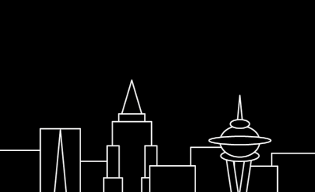
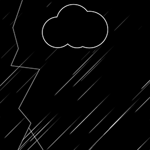
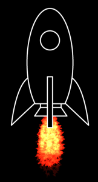

# Particle Park

Particle Park is a showcase for community created particle effects for LibGDX.

## Premise

 With the success of the [Scene2D.UI Skins](https://ray3k.wordpress.com/artwork/) project, it was time address the community's next largest need: particle effects. Despite great support and an official editor, particle effect examples were few and far between. The goal of this project is to create an abundance of such examples that can be dropped into your very own game. The effects are to be framed in a simple catalog program using animation and selectable options to best represent their use in context.

## How to use

Download and run a [release version](https://github.com/raeleus/Particle-Park/releases) of Particle Park. Browse the different scenes and select an effect to download. See the [libGDX wiki](https://libgdx.com/wiki/graphics/2d/2d-particleeffects) on the subject of implementing particle effects in your games.

Adding your own particle effects to the catalog is a simple process. Just copy the associated particle files into the locally generated data folder of the scene you want to view them in. The effect will now be selectable on the next startup of the catalog.

## Submitting Particle Effects

 We are accepting particle effect submissions! Please [create an issue](https://github.com/raeleus/Particle-Park/issues) and attach the required files for your effect. Include copyright text such as the following:

> Copyright (C) 2019 Raymond Buckley

Specify the type of license you wish to be attached to your work. We suggest looking at [Creative Commons](https://creativecommons.org/) for guidance in this matter.

Suggest an existing scene for this effect to be added to. New scenes can be suggested with consideration to time/interest. All submissions are subject to approval based on quality and usefulness.

## About

 Particle Park is developed by Raeleus for the LibGDX community.
Copyright (c) 2019 Raymond Buckley.

All particle effects donated graciously by community members.
See attached credit files.

Music from Jukedeck - create your own at http://jukedeck.com
